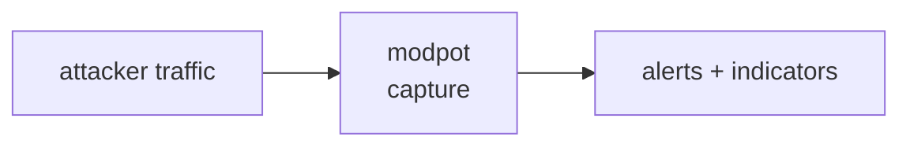

<a name="top"></a>
<div align="center">


# MODPOT

### Spin up a high-interaction Modbus/DNP3 ICS honeypot that logs attacker register reads/writes as structured JSON.


[](https://pypi.org/project/cognis-modpot/) [](https://github.com/cognis-digital/modpot/actions) [](LICENSE) [](https://github.com/cognis-digital)

*IoT / OT / Embedded — firmware, buses, and device security.*

</div>

```bash
pip install cognis-modpot
modpot analyze capture.hexlog        # → classified Modbus threat events
```

## Usage — step by step

`modpot` is a standard-library Modbus TCP honeypot that decodes and classifies attacker register reads/writes as JSON threat events. Console script: `modpot`.

1. **Install**:
   ```bash
   pipx install modpot     # or: pip install modpot
   ```
2. **Analyze a captured hex log** of Modbus frames and print a classified threat table (the `--format` flag is global, before the subcommand):
   ```bash
   modpot analyze capture.hexlog
   cat capture.hexlog | modpot analyze -        # read frames from stdin
   ```
   Exit `1` = at least one high-severity event (write/control/recon), `0` = none.
3. **Filter to serious events** and emit JSON for a SIEM:
   ```bash
   modpot --format json analyze capture.hexlog --min-severity high | jq '.[].reasons'
   ```
4. **Run a live honeypot listener** (no root needed on a high port); every request is logged as a JSON event on stdout:
   ```bash
   modpot serve --host 0.0.0.0 --port 5020
   ```
5. **Use it as a CI / alerting gate** over a capture — fail when control-plane writes appear:
   ```bash
   modpot analyze capture.hexlog --min-severity high || echo "high-severity Modbus activity — alerting"
   ```

## Contents

- [Why modpot?](#why) · [Features](#features) · [Quick start](#quick-start) · [Example](#example) · [Demos](#demos) · [Architecture](#architecture) · [AI stack](#ai-stack) · [How it compares](#how-it-compares) · [Integrations](#integrations) · [Install anywhere](#install-anywhere) · [Related](#related) · [Contributing](#contributing)

<a name="why"></a>
## Why modpot?

OT threat-intel content engine — drop it on a VPS, share the 'someone tried to open my fake water-treatment valve' logs. ICS honeypot captures get major infosec-Twitter traction.

`modpot` is single-purpose, scriptable, and self-hostable: point it at a target, get prioritized results in the format your workflow already speaks (table · JSON · SARIF), gate CI on it, and let agents drive it over MCP.

<div align="right"><a href="#top">↑ back to top</a></div>

<a name="features"></a>
## Features

- ✅ Parse Frame
- ✅ Build Response
- ✅ Classify Event
- ✅ Frame To Event
- ✅ Iter Frames From Hexlog
- ✅ Analyze Capture
- ✅ Runs on Linux/macOS/Windows · Docker · devcontainer
- ✅ Ports in Python, JavaScript, Go, and Rust (`ports/`)

<div align="right"><a href="#top">↑ back to top</a></div>

<a name="quick-start"></a>
## Quick start

```bash
pip install cognis-modpot
modpot --version
modpot analyze capture.hexlog                       # decode + classify a capture
modpot --format json analyze capture.hexlog         # machine-readable (SIEM)
modpot --format sarif analyze capture.hexlog        # SARIF for code-scanning
modpot analyze capture.hexlog --min-severity high   # CI gate (non-zero exit)
```

<div align="right"><a href="#top">↑ back to top</a></div>

<a name="example"></a>
## Example

```text
$ modpot analyze demos/04-water-treatment-tamper/capture.hexlog
SEV     SRC              FUNCTION                     ADDR   QTY  REASONS
-------------------------------------------------------------------------
low     10.0.4.10        read_holding_registers        100     4  benign register read
high    185.220.101.7    report_server_id                         suspicious function report_server_id (recon/tamper); undecodable PDU (malformed/fuzz traffic)
high    185.220.101.7    write_single_coil              16        register/coil write attempt against control device
high    185.220.101.7    write_single_register         101        register/coil write attempt against control device
high    185.220.101.7    write_multiple_coils           16     5  register/coil write attempt against control device
-------------------------------------------------------------------------
total=5  high=4, low=1
```

`--format` is accepted **before or after** the subcommand, and supports
`table` (default), `json`, and `sarif`.


<div align="right"><a href="#top">↑ back to top</a></div>

<a name="demos"></a>
## Demos

Every demo under [`demos/`](demos/) is a real Modbus TCP capture in the
tool's actual input format (`<src> | <hex>` per line) plus a `SCENARIO.md`
explaining where the traffic came from, the exact run command, what to
expect, and how to act. Each one is verified by the test suite to produce
the finding it describes.

| Demo | Scenario | Outcome |
|---|---|---|
| [`01-basic`](demos/01-basic/) | Small mixed capture (reads, writes, recon, malformed) | high + medium + low |
| [`02-clean`](demos/02-clean/) | Trusted HMI reads only — negative control | exit 0 |
| [`03-mixed`](demos/03-mixed/) | Mostly benign polling with one hostile source | high |
| [`04-water-treatment-tamper`](demos/04-water-treatment-tamper/) | Chlorine-dosing valve/setpoint writes | 4× high |
| [`05-port-scan-recon`](demos/05-port-scan-recon/) | Internet-wide scanner fingerprinting `:502` | 3× high (recon) |
| [`06-plc-restart-diagnostics`](demos/06-plc-restart-diagnostics/) | Restart / clear-counters / listen-only via FC 0x08 | 3× high |
| [`07-fuzzing-campaign`](demos/07-fuzzing-campaign/) | Malformed/truncated frames — all recorded | high + medium |
| [`08-benign-scada-poll`](demos/08-benign-scada-poll/) | Normal cyclic SCADA polling | exit 0 |
| [`09-setpoint-override`](demos/09-setpoint-override/) | Turbine overspeed-trip setpoint tamper (mask-write) | 3× high |
| [`10-multi-unit-sweep`](demos/10-multi-unit-sweep/) | One peer walking unit ids behind a gateway | reads-only, exit 0 |
| [`11-coil-flood`](demos/11-coil-flood/) | Mass coil writes flipping actuators | 3× high |

```bash
python -m modpot analyze demos/09-setpoint-override/capture.hexlog
python -m modpot --format sarif analyze demos/05-port-scan-recon/capture.hexlog > recon.sarif
```

<div align="right"><a href="#top">↑ back to top</a></div>

<a name="architecture"></a>
## Architecture



<div align="right"><a href="#top">↑ back to top</a></div>

<a name="ai-stack"></a>
## Use it from any AI stack

`modpot` is interoperable with every popular way of using AI:

- **MCP server** — `modpot mcp` (Claude Desktop, Cursor, Cognis.Studio, [uncensored-fleet](https://github.com/cognis-digital/uncensored-fleet))
- **OpenAI-compatible / JSON** — pipe `modpot scan . --format json` into any agent or LLM
- **LangChain · CrewAI · AutoGen · LlamaIndex** — wrap the CLI/JSON as a tool in one line
- **CI / scripts** — exit codes + SARIF for non-AI pipelines

<div align="right"><a href="#top">↑ back to top</a></div>

<a name="how-it-compares"></a>
## How it compares

| | **Cognis modpot** | conpot |
|---|:---:|:---:|
| Self-hostable, no account | ✅ | varies |
| Single command, zero config | ✅ | ⚠️ |
| JSON + SARIF for CI | ✅ | varies |
| MCP-native (AI agents) | ✅ | ❌ |
| Polyglot ports (JS/Go/Rust) | ✅ | ❌ |
| Open license | ✅ COCL | varies |

*Built in the spirit of **conpot**, re-framed the Cognis way. Missing a credit? Open a PR.*

<div align="right"><a href="#top">↑ back to top</a></div>

<a name="integrations"></a>
## Integrations

Pipes into your stack: **SARIF** for code-scanning, **JSON** for anything, an **MCP server** (`modpot mcp`) for AI agents, and a webhook forwarder for SIEM/Slack/Jira. See [`docs/INTEGRATIONS.md`](docs/INTEGRATIONS.md).

<div align="right"><a href="#top">↑ back to top</a></div>

<a name="install-anywhere"></a>
## Install — every way, every platform

```bash
pip install "git+https://github.com/cognis-digital/modpot.git"    # pip (works today)
pipx install "git+https://github.com/cognis-digital/modpot.git"   # isolated CLI
uv tool install "git+https://github.com/cognis-digital/modpot.git" # uv
pip install cognis-modpot                                          # PyPI (when published)
docker run --rm ghcr.io/cognis-digital/modpot:latest --help        # Docker
brew install cognis-digital/tap/modpot                             # Homebrew tap
curl -fsSL https://raw.githubusercontent.com/cognis-digital/modpot/main/install.sh | sh
```

| Linux | macOS | Windows | Docker | Cloud |
|---|---|---|---|---|
| `scripts/setup-linux.sh` | `scripts/setup-macos.sh` | `scripts/setup-windows.ps1` | `docker run ghcr.io/cognis-digital/modpot` | [DEPLOY.md](docs/DEPLOY.md) (AWS/Azure/GCP/k8s) |

<div align="right"><a href="#top">↑ back to top</a></div>

<a name="related"></a>
## Related Cognis tools

- [`fwxray`](https://github.com/cognis-digital/fwxray) — Diff two firmware images and surface exactly what changed: new binaries, flipped config flags, added certs, and shifted entropy regions.
- [`canzap`](https://github.com/cognis-digital/canzap) — Replay, fuzz, and assert on CAN bus traffic from a .pcap or SocketCAN interface with a tiny YAML DSL.
- [`sbomb`](https://github.com/cognis-digital/sbomb) — Generate a CycloneDX SBOM directly from an unpacked firmware root filesystem and flag components with known CVEs and EOL kernels.
- [`mqttspy`](https://github.com/cognis-digital/mqttspy) — Passively map an MQTT broker: enumerate topics, detect unauthenticated writes, spot PII/secrets in payloads, and emit a risk report.
- [`uefiscan`](https://github.com/cognis-digital/uefiscan) — Audit UEFI firmware dumps for missing Secure Boot keys, unsigned modules, S3 boot-script vulns, and known SMM threats.
- [`keyhunt`](https://github.com/cognis-digital/keyhunt) — Scan firmware blobs and filesystem dumps for hardcoded private keys, API tokens, default creds, and weak RSA/ECC material.

**Explore the suite →** [🗂️ all 170+ tools](https://github.com/cognis-digital/cognis-neural-suite) · [⭐ awesome-cognis](https://github.com/cognis-digital/awesome-cognis) · [🔗 cognis-sources](https://github.com/cognis-digital/cognis-sources) · [🤖 uncensored-fleet](https://github.com/cognis-digital/uncensored-fleet) · [🧠 engram](https://github.com/cognis-digital/engram)

<div align="right"><a href="#top">↑ back to top</a></div>

<a name="contributing"></a>
## Contributing

PRs, new rules, and demo scenarios are welcome under the collaboration-pull model — see [CONTRIBUTING.md](CONTRIBUTING.md) and [SECURITY.md](SECURITY.md).

> ### ⭐ If `modpot` saved you time, **star it** — it genuinely helps others find it.

## Interoperability

`{}` composes with the 300+ tool Cognis suite — JSON in/out and a shared
OpenAI-compatible `/v1` backbone. See **[INTEROP.md](INTEROP.md)** for the
suite map, composition patterns, and reference stacks.

## License

Source-available under the **Cognis Open Collaboration License (COCL) v1.0** — free for personal, internal-evaluation, research, and educational use; **commercial / production use requires a license** (licensing@cognis.digital). See [LICENSE](LICENSE).

---

<div align="center"><sub><b><a href="https://cognis.digital">Cognis Digital</a></b> · one of 170+ tools in the <a href="https://github.com/cognis-digital/cognis-neural-suite">Cognis Neural Suite</a> · <i>Making Tomorrow Better Today</i></sub></div>
